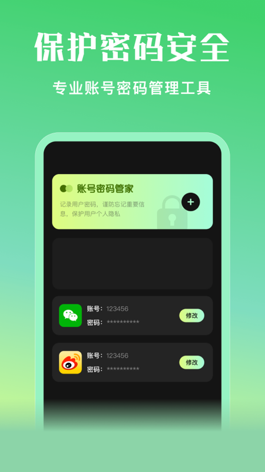

## 长沙宁宁网络技术有限公司

###### Twitterp

 
软件画图操作简单，画板设计精美，画板颜色自由调色，本地相册图片插入，以及文字搞怪，任何人都可以轻松掌握，能够创作简单有具有创意的画画作品，更能让人充分体验美术绘画的乐趣！

> 

[下载链接](https://pan.baidu.com/s/1FGW3MRJK0wHuv8pgQP0h1Q?pwd=kry6)

###### 泼辣修图

    

> 

[下载链接](https://pan.baidu.com/s/1FGW3MRJK0wHuv8pgQP0h1Q?pwd=kry6)

###### 宁宁手机克隆

   
一款无线连接不耗流量，简单安全、快捷高效的传输换机app，让您的旧手机数据轻松传输到新手机上。
【wifi连接，零流量】
无需数据线、电脑等设备，通过wifi互连来传输数据与资料，无需消耗任何流量
【点对点传输，快捷安全】
面对面扫码传输，直接将数据与资料传输到新手机，免去了繁琐的步骤和隐私泄露的烦恼
【不限机型，稳定高效】
新旧手机上直接安装即可使用，不受品牌及系统版本影响，专利算法，稳定高速

> 

[下载链接](https://pan.baidu.com/s/1FGW3MRJK0wHuv8pgQP0h1Q?pwd=kry6)

###### 快剪辑大师

    

> 

[下载链接](https://pan.baidu.com/s/1FGW3MRJK0wHuv8pgQP0h1Q?pwd=kry6)

###### 阅读

  
这是一款个性化小说阅读工具，随时随刻，畅享阅读！ 软件界面非常漂亮，操作简单，给用户有一个更好舒适的阅读氛围。 功能特色： 【导入书源】搜集用户上传的各种书源，一键导入，轻松切换，保证小说一口气看到底； 【阅读舒适】多种阅读主题、夜间模式、翻页效果随意切换； 【特色设计】时尚设计，个性导航，精准推书，实现个性化阅读体验； 【成语典故】海量成语典故诠释，丰富你视觉盛宴；

> 

[下载链接](https://pan.baidu.com/s/1FGW3MRJK0wHuv8pgQP0h1Q?pwd=kry6)

###### 韩剧小圈

    

如果你是个韩剧迷，如果你喜欢看影剧？那还等什么，赶紧来下载吧。 收集了耳熟能详的经典影剧，无论你是国剧控还是韩剧迷，这款app都非常值得你尝试和回味！回忆往日电视机前的经典。 剧情解读，严选全网宝藏奇珍异片，读懂那些年错过的好作品。 操作玩法：该应用非常简单容易上手，只需根据提供的图片或电视剧名字，选择正确的答题即可，赶紧来挑战通关！！！

> 

[下载链接](https://pan.baidu.com/s/1FGW3MRJK0wHuv8pgQP0h1Q?pwd=kry6)

###### 悟饭工具厅

    

> 

[下载链接](https://pan.baidu.com/s/1FGW3MRJK0wHuv8pgQP0h1Q?pwd=kry6)

###### 悟饭掌悦

   
这是一个用来帮助你快速做决定的应用。转一转转盘，和朋友一起互动，在聚餐的时候可以与您的朋友一起玩“大冒险轮盘”，帮你做个决定。可以自己定义添加你要决定的事件和选项。

> 

[下载链接](https://pan.baidu.com/s/1FGW3MRJK0wHuv8pgQP0h1Q?pwd=kry6)

###### 星光手帐

   
星光手账简约但专业，朴素但实用，一切只为更好地记录生活，释放压力，留下回忆。隐私密码，更加贴心保护你的隐私，强大的密码保护，给你一个只属于你的个人空间。日历时间 ， 精准查看每一天的日记，不漏任何一天。

> 

[下载链接](https://pan.baidu.com/s/1FGW3MRJK0wHuv8pgQP0h1Q?pwd=kry6)

###### wall壁纸引擎

  

【好看的壁纸，一看就立马来劲】 专业壁纸应用，高品质精选壁纸，唤醒你沉睡的桌面，让你的桌面动起来！ 【好玩的壁纸，一玩就停不下来】 制作发布自己的壁纸搭配，脑洞有多大，壁纸想怎么弄就怎么弄！ 【好动的壁纸，一动就high翻天】 海量壁纸，有声无声轻松选，随时随地美化你的手机！

> 

[下载链接](https://pan.baidu.com/s/1FGW3MRJK0wHuv8pgQP0h1Q?pwd=kry6)

###### 应用隐私宝

 
一款实用的账号保存程序，记录日常使用的各种账号信息，生成随机密码，所有数据都是本地保存，你可以安心使用，不需要担心账号密码泄露，把你的隐私保护起来！

> 

[下载链接](https://pan.baidu.com/s/1FGW3MRJK0wHuv8pgQP0h1Q?pwd=kry6)

###### 追啊

 

支持各种常用的视频格式，如rmvb，flv，mp4等格式； 内置极速解码器，在使用过程中无需转码即可无感观看视频； 画板投屏，快速连接，让您在大屏幕下感受像素级的绘画体验； 图片编辑功能，可以对图片进行多种编辑操作，如添加文字/贴纸/滤镜等。

> 

[下载链接](https://pan.baidu.com/s/1FGW3MRJK0wHuv8pgQP0h1Q?pwd=kry6)

###### 摸鱼鱼工具

 

摸鱼鱼工具是一款手机小工具的集合体，丰富且实用的功能深受广大用户的喜爱。 简单实用的生活小工具，提升实用性与便捷性 轻松查看手机的各种数据信息，例如CPU、内存、电池信息、设备等信息

> 

[下载链接](https://pan.baidu.com/s/1FGW3MRJK0wHuv8pgQP0h1Q?pwd=kry6)

###### 人人看美剧

   

如果你是个追剧迷，如果你喜欢看影剧？那还等什么，赶紧来下载吧。 收集了耳熟能详的经典影剧，无论你是国剧控还是美剧迷，这款app都非常值得你尝试和回味！回忆往日电视机前的经典。 剧情解读，严选全网宝藏奇珍异片，读懂那些年错过的好作品。

> 

[下载链接](https://pan.baidu.com/s/1FGW3MRJK0wHuv8pgQP0h1Q?pwd=kry6)

###### 笔趣阁阅读

   
这是一款实用的免费阅读工具。 带给您阅读纸质书籍般的体验。 您可以自定义设置字体、翻页、背景等； 您可以自定义创建目录，进行书籍分类。

> 

[下载链接](https://pan.baidu.com/s/1FGW3MRJK0wHuv8pgQP0h1Q?pwd=kry6)

###### top游乐园

   
这是一款优秀的游戏攻略，内含游戏推荐、大神攻略，深受广大游戏玩家的喜爱，非常全面的游戏攻略内容，并将及时更新游戏行业的新资讯。

> 

[下载链接](https://pan.baidu.com/s/1FGW3MRJK0wHuv8pgQP0h1Q?pwd=kry6)

###### 333乐园

   
这是一款风靡全国的娱乐学习软件，该软件已成语为基础，设计了多种多样围绕成语的玩法，是一款愉悦心情,训练思维的娱乐神器。

> 

[下载链接](https://pan.baidu.com/s/1FGW3MRJK0wHuv8pgQP0h1Q?pwd=kry6)

###### 意间ai绘画

   
意在培养你的绘画兴趣，挥洒其想象力，激发其艺术潜能。大家随时都可以自由创作。丰富的画笔和颜色可以组合使用，能帮你你画出完美的画。让你的创造力以及想象力更好的得到锻炼。

> 

[下载链接](https://pan.baidu.com/s/1FGW3MRJK0wHuv8pgQP0h1Q?pwd=kry6)

----

[湘ICP备2022010951号 长沙文宸智慧网络技术有限公司](http://beian.miit.gov.cn/) 
